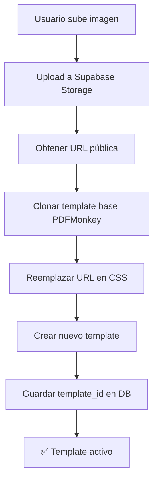

# Sistema Simplificado: Upload de Imagen de Fondo para PDFs

## 🎯 Resumen

En lugar de subir templates HTML completos, las agencias ahora pueden **simplemente subir una imagen de fondo** (header + footer) y el sistema automáticamente:
1. Clona el template base de PDFMonkey
2. Reemplaza la URL del background en el CSS
3. Activa el nuevo template personalizado

## ✅ Ventajas del Sistema Simplificado

| Aspecto | Sistema Anterior (HTML) | Sistema Nuevo (Imagen) |
|---------|------------------------|------------------------|
| **Complejidad** | Alta (requiere HTML/CSS) | Baja (solo subir imagen) |
| **Tiempo Setup** | ~30 minutos | ~2 minutos |
| **Errores Posibles** | Muchos (HTML mal formado) | Pocos (solo validación de imagen) |
| **UX** | Técnico | User-friendly |
| **Flexibilidad** | Total | Alta (suficiente para 90% casos) |

## 📋 Cómo Funciona

### 1. Agencia Sube Imagen

```
Settings → PDF Templates → [Seleccionar tipo] → Upload Background
```

### 2. Sistema Procesa Automáticamente



### 3. Generación de PDF

Cuando se genera un PDF:
- Sistema detecta `custom_template_id` para la agencia
- Usa template con background personalizado
- Si no existe custom, usa template por defecto

## 🎨 Especificaciones de la Imagen

### Dimensiones Recomendadas
```
Ancho: 800px
Alto: 1132px
Formato: A4 Portrait
```

### Zonas de la Imagen

```
┌─────────────────────────────────┐
│  HEADER (180px altura)          │  ← Logo, branding, colores
│  - Logo de la agencia           │
│  - Colores corporativos         │
│  - Elementos decorativos        │
├─────────────────────────────────┤
│                                 │
│  ÁREA DE CONTENIDO (872px)     │  ← Fondo claro/transparente
│  - Mantener fondo neutro        │
│  - Watermark sutil (opcional)   │
│  - Alto contraste para texto    │
│                                 │
│                                 │
│                                 │
├─────────────────────────────────┤
│  FOOTER (80px altura)           │  ← Contacto, disclaimers
│  - Información de contacto      │
│  - WhatsApp, Email, Tel         │
│  - Avisos legales               │
└─────────────────────────────────┘
```

### Formatos Soportados
- **PNG** (recomendado - soporta transparencia)
- JPG
- WebP
- Tamaño máximo: 5MB

## 💻 Implementación Técnica

### Archivos Creados

1. **`supabase/migrations/20251006000001_add_custom_pdf_templates.sql`**
   - Agrega columna `pdf_backgrounds` JSONB
   - Almacena URLs de imágenes por tipo de template

2. **`supabase/migrations/20251006000002_create_pdf_backgrounds_bucket.sql`**
   - Crea bucket de storage `pdf-backgrounds`
   - Políticas RLS para upload/read

3. **`src/services/pdfMonkeyTemplates.ts`**
   - `cloneTemplateWithNewBackground()`: Clona template y cambia CSS
   - `updateTemplateBackground()`: Actualiza background en template existente

4. **`src/components/settings/BackgroundImageUploader.tsx`**
   - Componente para upload por tipo de template
   - Preview de imagen actual
   - Manejo de estados (loading, uploading)

5. **`src/components/settings/SimplePdfTemplateManager.tsx`**
   - Grid de 4 tipos de templates
   - Guías de diseño
   - Instrucciones para usuario

### Estructura de Datos en DB

```sql
-- agencies table
pdf_backgrounds: {
  "combined": "https://supabase.../agency-a-combined.png",
  "flights": "https://supabase.../agency-a-flights.png",
  "flights2": null,  -- usando default
  "hotels": "https://supabase.../agency-a-hotels.png"
}

custom_template_ids: {
  "combined": "uuid-del-template-clonado",
  "flights": "uuid-del-template-clonado",
  "flights2": null,
  "hotels": "uuid-del-template-clonado"
}
```

### Flujo de Código

#### Upload de Imagen
```typescript
// 1. Upload a Storage
const { data } = await supabase.storage
  .from('pdf-backgrounds')
  .upload(fileName, file);

// 2. Obtener URL pública
const { publicUrl } = supabase.storage
  .from('pdf-backgrounds')
  .getPublicUrl(data.path);

// 3. Clonar template con nueva URL
const newTemplate = await cloneTemplateWithNewBackground(
  DEFAULT_TEMPLATE_IDS[templateType],
  `${agencyName} - ${templateType}`,
  publicUrl
);

// 4. Guardar en DB
await supabase
  .from('agencies')
  .update({
    pdf_backgrounds: { [templateType]: publicUrl },
    custom_template_ids: { [templateType]: newTemplate.id }
  })
  .eq('id', agencyId);
```

#### Clonación de Template
```typescript
export async function cloneTemplateWithNewBackground(
  sourceTemplateId: string,
  newIdentifier: string,
  newBackgroundUrl: string
): Promise<TemplateResponse> {
  // 1. Obtener template original
  const sourceTemplate = await getTemplate(sourceTemplateId);

  // 2. Reemplazar URL en CSS
  const updatedCSS = sourceTemplate.scss_style?.replace(
    /background:\s*url\(['"].*?['"]\)/gi,
    `background: url('${newBackgroundUrl}')`
  );

  // 3. Crear nuevo template
  return await createTemplate({
    identifier: newIdentifier,
    body: sourceTemplate.body,        // HTML sin cambios
    scss_style: updatedCSS,            // Solo CSS modificado
    settings: sourceTemplate.settings
  });
}
```

## 📖 Guía de Usuario

### Paso 1: Crear la Imagen de Fondo

1. **Diseñar en Photoshop/Figma/Canva:**
   - Tamaño: 800x1132px
   - Resolución: 72-150 DPI
   - Modo: RGB

2. **Elementos a incluir:**
   - Logo de la agencia (arriba)
   - Colores corporativos
   - Información de contacto (abajo)
   - Watermark sutil (opcional)

3. **Exportar:**
   - Formato PNG (mejor opción)
   - Optimizar tamaño (< 1MB ideal)

### Paso 2: Subir a la Plataforma

1. Ir a **Settings → PDF Templates**
2. Seleccionar tipo de template (Combined, Flights, etc.)
3. Click en **"Upload Background"**
4. Seleccionar imagen
5. Esperar confirmación (aparece preview)

### Paso 3: Verificar

1. Generar un PDF de prueba en `/chat`
2. Verificar que el diseño se vea correcto
3. Si necesita ajustes, subir nueva imagen

## 🔧 Troubleshooting

### Imagen no se muestra en el PDF

**Posibles causas:**
1. URL no es pública → Verificar políticas de storage
2. Imagen muy pesada → Optimizar tamaño
3. Template no se activó → Verificar `custom_template_ids` en DB

**Solución:**
```sql
-- Verificar datos en DB
SELECT
  name,
  pdf_backgrounds,
  custom_template_ids
FROM agencies
WHERE id = 'agency-id';
```

### PDF usa template por defecto

**Causa:** No hay `custom_template_id` guardado

**Solución:** Re-subir la imagen o verificar logs de errores

### Imagen pixelada

**Causa:** Resolución baja

**Solución:** Usar imagen de mayor resolución (mín 800px ancho)

## 🚀 Próximos Pasos Potenciales

Mejoras futuras que se pueden implementar:

1. **Editor Visual:**
   - Drag & drop de logo
   - Color picker para branding
   - Preview en tiempo real

2. **Templates Pre-diseñados:**
   - Galería de backgrounds
   - Selección rápida sin diseñar

3. **Multi-idioma:**
   - Backgrounds para diferentes idiomas
   - Selector de idioma al generar PDF

4. **Versioning:**
   - Historial de backgrounds
   - Rollback a versión anterior

## 📊 Comparación: Antes vs Ahora

### Antes (Sistema de HTML Completo)
```
1. Agencia descarga template base
2. Edita HTML (necesita conocimientos)
3. Modifica CSS
4. Prueba localmente
5. Sube HTML completo
6. Sistema valida HTML
7. Crea template en PDFMonkey
   ⏱️ Tiempo: 30+ minutos
   🎓 Nivel técnico: Alto
```

### Ahora (Sistema de Imagen)
```
1. Agencia diseña imagen en Canva
2. Sube imagen (drag & drop)
3. Sistema automáticamente:
   - Sube a storage
   - Clona template
   - Reemplaza background
   - Activa template
   ⏱️ Tiempo: 2-3 minutos
   🎓 Nivel técnico: Básico
```

## 🎯 Casos de Uso Reales

### Caso 1: Agencia Boutique
- **Necesidad:** Logo y colores corporativos únicos
- **Solución:** Imagen con branding personalizado
- **Resultado:** PDFs con identidad visual propia

### Caso 2: Multi-marca
- **Necesidad:** Diferentes marcas bajo misma agencia
- **Solución:** Background diferente por tipo de viaje
  - Flights: Marca aérea
  - Hotels: Marca hotelera
  - Combined: Marca general

### Caso 3: Temporadas Especiales
- **Necesidad:** Promociones de verano/invierno
- **Solución:** Cambiar background según temporada
- **Beneficio:** Fácil actualización (solo cambiar imagen)

## 📝 Checklist de Implementación

- [x] Migración DB con campo `pdf_backgrounds`
- [x] Storage bucket `pdf-backgrounds` con políticas RLS
- [x] Función `cloneTemplateWithNewBackground()`
- [x] Componente `BackgroundImageUploader`
- [x] Componente `SimplePdfTemplateManager`
- [x] Integración en Settings page
- [x] Export de `DEFAULT_TEMPLATE_IDS` desde pdfMonkey.ts
- [ ] Aplicar migraciones en producción
- [ ] Probar upload completo
- [ ] Generar PDF de prueba
- [ ] Documentación para usuarios finales

## 🎓 Recursos

### Para Diseñadores
- [Canva Templates](https://www.canva.com/templates/) - Crear backgrounds fácilmente
- [Figma A4 Template](https://www.figma.com/community/file/a4-template) - Diseño profesional
- [TinyPNG](https://tinypng.com/) - Optimizar imágenes

### Para Desarrolladores
- [PDFMonkey API Docs](https://docs.pdfmonkey.io/references/api)
- [Supabase Storage](https://supabase.com/docs/guides/storage)
- [Liquid Template Language](https://shopify.github.io/liquid/)

---

**Última actualización:** 2025-10-06
**Versión:** 1.0
**Status:** ✅ Implementado y Listo para Usar
